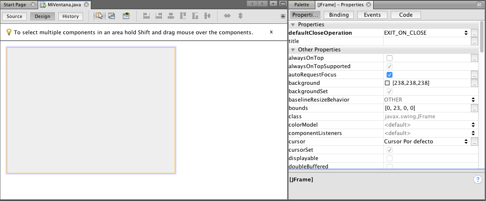
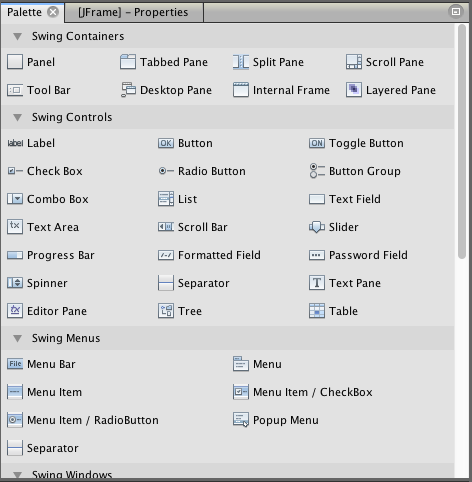
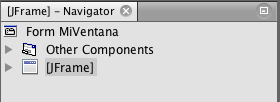
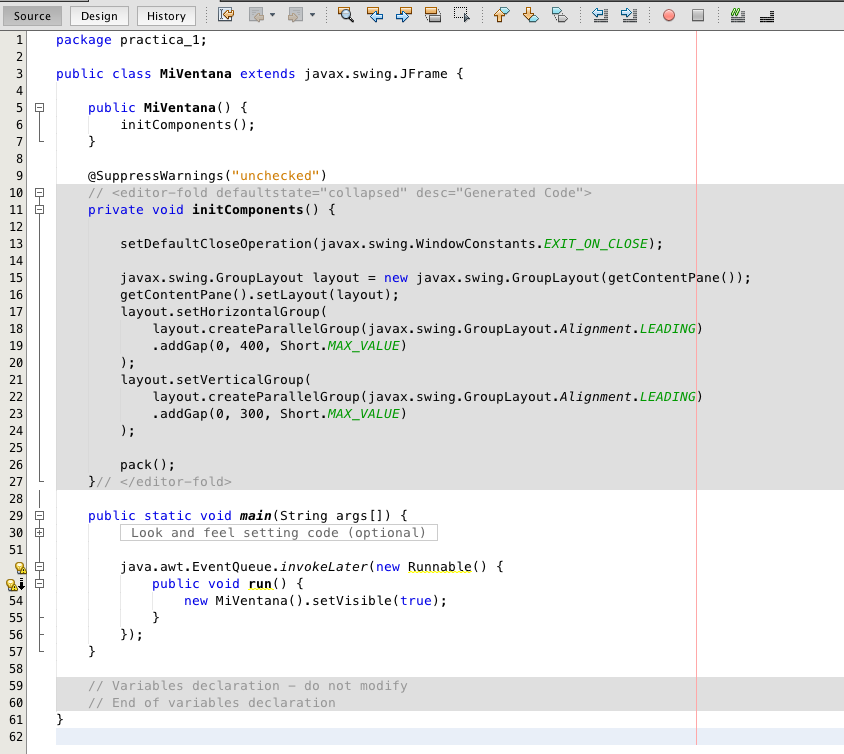
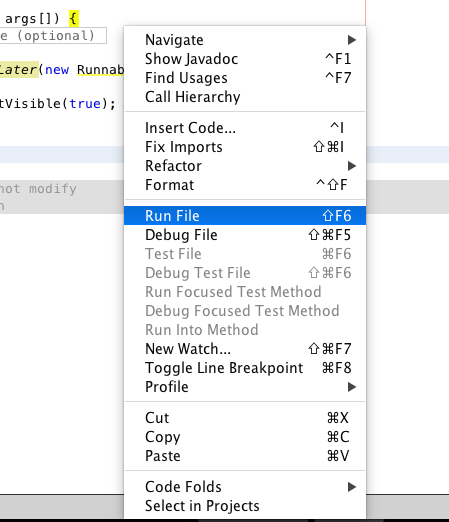
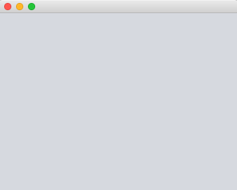

# Práctica I - Introducción a Swing

Swing es un conjunto de clases para construir interfaces gráficas la cual es nativa de Java. Puedes consultar la documentación en [https://docs.oracle.com/javase/7/docs/api/javax/swing/package-summary.html](https://docs.oracle.com/javase/7/docs/api/javax/swing/package-summary.html)

## Crear una ventana

* Crea un proyecto y dentro de un paquete da clic secundario en `JFrame Form...`

Se abrirá el editor gráfico configurado por defecto mostrando en el centro el área de la ventana con su tamaño por defecto, a la derecha puedes ubicar las propiedades del elemento seleccionado y la paleta de controles predefinidos, además en la parte de abajo podrás observar la jeraquía de los elementos.

* Selecciona la pestaña `Source` (por defecto está en `Design`) para ver el código generado y la clase asociada a la ventana.

Cada ventana tiene un archivo `.java` que define la clase que controla la ventana. Observa los siguientes puntos:

> La clase deriva de `javax.swing.JFrame`, esto implica que tenemos todos los elementos de la clase `JFrame` más lo definido en nuestro código

> La clase define un constructor que invoca el método `initComponents();` definido abajo

> El método `initComponents` no puede ser modificado por el usuario y aparece sombreado sin posibilidad de editar, este código está siendo administrado por netbeans y define todos los controles que están siendo arrastrados de la paleta a la ventana

> Existe un punto de entrada (el método `public static void main(...)`) el cual lanza la ventana en una especie de hilo usando `java.awt.EventQueue.invokeLater`, este recibe un objeto anónimo de `Runnable` que en su método run ejecuta una nueva instancia de la clase y la hace visible

> Abajo hay más código que no se puede modificar y se encarga de definir las variables gráficas como botones y demás.

* Pulsa clic secundario o `shift+f6` para ejecutar el archivo `Run File...`

* El resultado será una ventana vacía nativa del sistema operativo :D

## Problemas

* Lista 5 propiedades de la ventana disponibles en el panel de propiedades, por ejemplo `title - Modifica el título de la ventana`.

* Cambia la propiedad `Generate Center` de la pestaña `Code` en el panel de propiedades para mostrar la ventana centrada en la pantalla.

* Cambia el color de fondo de la ventana a `AWT Palette` con valor `Dark Gray`.

* Modifica la propiedad que evita que el usuario pueda cambiar el tamaño de la ventana.

* Ve a la pestaña `Events` del panel de propiedades y busca el evento `windowOpened` luego selecciona `<none>` para crear un nuevo evento por defecto `formWindowOpened`. Dentro del método creado en `Source` coloca `System.out.println("Hola, se ha abierto la ventana D:");`.

> __Nota:__ Comprime tu proyecto en `ZIP` (no `RAR`, no `7z`, no otros) y guardalo en una memoria USB o envíalo a tu correo. Las prácticas deberás entregarlas a más tardar antes de la siguiente clase de viernes (una semana máximo) al correo `badillo.soft@hotmail.com` con el asunto `Práctica I - <TU PRIMER NOMBRE Y PRIMER APELLIDO>`.

> __Nota:__ En el mismo archivo comprimido `ZIP` deberás adjuntar un archivo `<TU PRIMER NOMBRE Y PRIMER APELLIDO>.txt` que contenga las respuestas que se piden como texto (como la lista de las 5 propiedades con su descripción). En caso de no solicitar respuestas escritas deberás crear igualmente el archivo pero dejarlo vacío. Si se requieren capturas de pantalla, deberás adjuntarlas en una carpeta llamada `capturas`.

> __Nota:__ En caso de no seguir estas instrucciones la práctica no será recibida hasta el final del curso con un puntaje del `50%` solamente. La suma total de cada práctica es de `100 puntos` distribuidos por número de incisos sin importar si uno es más díficil que otro.

### Diplomado de Java - Alan Badillo Salas (badillo.soft@hotmail.com)

### Instituto Politécnico Nacional - Centro de Investigación en Cómputo