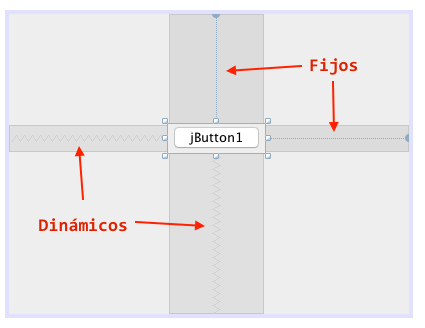
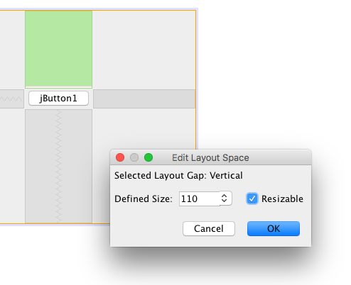
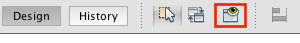

# Práctica II - Introducción a Swing

Al construir interfaces gráficas en swing dependeremos de los controles de la paleta y necesitaremos ajustar el diseño para que sea responsivo al tamaño de la ventana. Para esto existen dos conceptos: `espaciadores dinámicos` y `espaciadores fijos o anclas`.

## Espaciadores

Los espaciadores determinan la posición relativa absoluta o relativa dinámica entre los elementos. Cada elemento posee 4 espaciadores a su alto, bajo, izquierda y derecha. Cada espaciador puede ser de dos tipos: `fijo` o `redimensionable`.

Un `espaciador fijo` se considera una ancla y determina la distancia en pixeles que el elemento debería tener hacía arriba, abajo, izquierda o derecha del siguiente elemento. Arrastrando el control podemos observar que el espaciador aumenta o disminuye. En la siguiente imágen se muestran los dos tipo de espaciadores:

Observa que las regiones sombreadas a los lados del elemento representan los espaciadores y dentro de esa región se muestra un línea punteada para los espaciadores fijos y una cuerda en zig-zag para los espaciadores dinámicos.

Los espaciadores fijos siempre mantendrán el mismo tamaño del control hacia el lado indicado y por otro lado los dinámicos se ajustarán proporcionalmente a la distancia, por ejemplo si la ventana se hace más pequeña o grande.

Podemos alternar entre un espaciador fijo y dinámico dando doble clic sobre él, de esta forma se abrirá una ventana indicando el tamaño en pixeles del espaciador fijo, pero si se marca `resizable` el espaciador se convertirá en dinámico y si se desmarca se convertirá en fijo.

Puedes utilizar este ícono para no estar ejecutando a cada rato:

## Problemas

* Crea una ventana y arrastra un botón más o menos centrado (no seas preciso).

* Modifica todos los espaciadores del botón para que sean dinámicos.

* Ejecuta la ventana e indica que pasa cuando el usuario la hace más grande y más chica (CAPTURA ventana maximizada).

* Cambia el espaciador de arriba (para el botón) a fijo con un valor de `100`.

* Ejecuta nuevamente la ventana e indica la diferencia (CAPTURA ventana maximizada).

* Inserta dos botones de forma que queden centrados verticalmente y esten exactamente a `20 pixeles` de los extremos (la distancia entre ellos debe ser dinámica) (CAPTURA ventana maximizada).

> __Nota:__ Comprime tu proyecto en `ZIP` (no `RAR`, no `7z`, no otros) y guardalo en una memoria USB o envíalo a tu correo. Las prácticas deberás entregarlas a más tardar antes de la siguiente clase de viernes (una semana máximo) al correo `badillo.soft@hotmail.com` con el asunto `Práctica I - <TU PRIMER NOMBRE Y PRIMER APELLIDO>`.

> __Nota:__ En el mismo archivo comprimido `ZIP` deberás adjuntar un archivo `<TU PRIMER NOMBRE Y PRIMER APELLIDO>.txt` que contenga las respuestas que se piden como texto (como la lista de las 5 propiedades con su descripción). En caso de no solicitar respuestas escritas deberás crear igualmente el archivo pero dejarlo vacío. Si se requieren capturas de pantalla, deberás adjuntarlas en una carpeta llamada `capturas`.

> __Nota:__ En caso de no seguir estas instrucciones la práctica no será recibida hasta el final del curso con un puntaje del `50%` solamente. La suma total de cada práctica es de `100 puntos` distribuidos por número de incisos sin importar si uno es más díficil que otro.

### Diplomado de Java - Alan Badillo Salas (badillo.soft@hotmail.com)

### Instituto Politécnico Nacional - Centro de Investigación en Cómputo