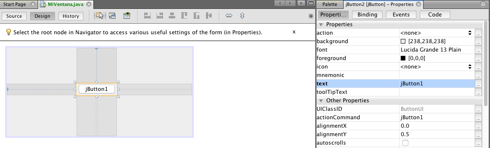
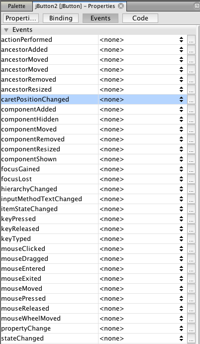
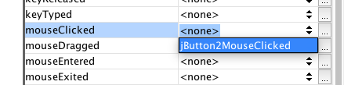
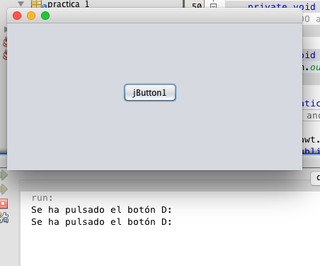

# Práctica IV - Eventos

Para controlar un evento de algún control de Swing debemos seleccionar el tipo de evento en la pestaña `Events` del panel de propiedades. Los eventos son acciones que ocurren en la interfaz gráfica e invocan métodos definidos por el usuario cuando se genera la acción durante la interacción del usuario con la interfaz. Los eventos más comunes en botones es cuando el usuario pulsa clic sobre un control, pulsa una tecla, se gana o pierde el foco del control, alguna propiedad importante cambia, etc.

## Controlar un evento

Para controlar un evento debemos seguir los siguientes pasos:

* Selecciona el control y visualiza el panel de propiedades:

* Selecciona la pestaña eventos:

* Selecciona el evento que quieres controlar y pulsa doble clic sobre el método sugerido

* Inserta código en el método creado automáticamente, por ejemplo, imprime algo en la consola y analiza lo que ocurre cuando el usuario interactúa con la interfaz

## Problemas

* Crea una ventana con un botón y una etiqueta

* Controla el evento `mouseClicked` del botón

* Cambia el texto del `JLabel` a `Se ha pulsado el botón D:` mediante el método `jLabel1.setText(...)`

* Crea una variable entera llamada `contador` inicializada en cero como atributo de la clase

* Incrementa el contador dentro del controlador del evento `mouseClicked`

* Muestra el número de clics en el `JLabel` (`usa String.format`)

* Se feliz :D

> __Nota:__ Comprime tu proyecto en `ZIP` (no `RAR`, no `7z`, no otros) y guardalo en una memoria USB o envíalo a tu correo. Las prácticas deberás entregarlas a más tardar antes de la siguiente clase de viernes (una semana máximo) al correo `badillo.soft@hotmail.com` con el asunto `Práctica I - <TU PRIMER NOMBRE Y PRIMER APELLIDO>`.

> __Nota:__ En el mismo archivo comprimido `ZIP` deberás adjuntar un archivo `<TU PRIMER NOMBRE Y PRIMER APELLIDO>.txt` que contenga las respuestas que se piden como texto (como la lista de las 5 propiedades con su descripción). En caso de no solicitar respuestas escritas deberás crear igualmente el archivo pero dejarlo vacío. Si se requieren capturas de pantalla, deberás adjuntarlas en una carpeta llamada `capturas`.

> __Nota:__ En caso de no seguir estas instrucciones la práctica no será recibida hasta el final del curso con un puntaje del `50%` solamente. La suma total de cada práctica es de `100 puntos` distribuidos por número de incisos sin importar si uno es más díficil que otro.

### Diplomado de Java - Alan Badillo Salas (badillo.soft@hotmail.com)

### Instituto Politécnico Nacional - Centro de Investigación en Cómputo