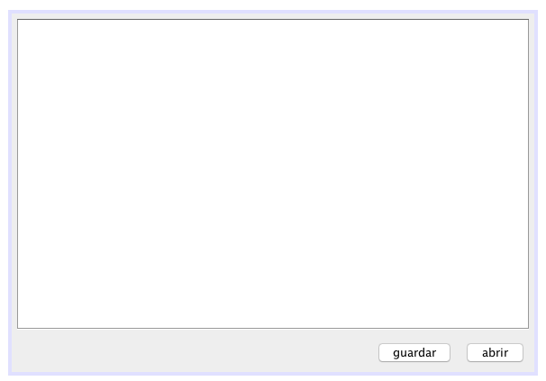

# Proyecto I - JNotePad v1.0

`JNotePad` será nuestro primer proyecto y consiste en crear un pequeño editor de texto plano mediante `JTextArea` y dos botones para abrir y guaVrdar.

## Diseño

El diseño consta de un `JTextArea` en la parte central y dos botones `JButton` como se muestra en la siguiente imagen:

Componentes:

* `JTextArea` - `txt_editor`

* `JButton` - `btn_abrir`

* `JButton` - `btn_guardar`

* `JFileChooser` - `fc_abrir`

* `JFileChooser` - `fc_guardar`

## 1. Abrir un documento

> Configurar `fc_abrir` en el constructor para que solo acepte archivos `txt`.

> Ajusta el evento `mouseClicked` de `btn_abrir` para mostrar un diálogo de apertura creado con `fc_abrir.showOpenDialog(this);`.

> Recuperar el archivo abierto `File f = fc_abrir.getSelectedFile();` y abrir un `FileInputStream in = new FileInputStream(f);`.

> Recuperar todas las líneas del archivo mediante `Scanner sc = new Scanner(in);`, `while(sc.hasNextLine()) { ... }`, `String linea = sc.nextLine()` y `txt_editor.setText(formato)` donde `formato` es un `String` que concatena el texto anterior de `txt_editor`, una nueva línea y la línea actual.

## 2. Guardar un documento

> Configurar `fc_guardar` en el constructor para que solo acepte archivos `txt`.

> Ajusta el evento `mouseClicked` de `btn_guardar` para mostrar un diálogo de guardar creado con `fc_guardar.showOpenDialog(this);`.

> Recuperar el archivo abierto `File f = fc_guardar.getSelectedFile();` y abrir un `FileOutputStream out = new FileOutputStream(f);`.

> Recuperar todas las líneas de `txt_editor` (`JTextArea`) y guardarlas en el archivo mediante `out.write(formato)`, usa el formato adecuado. __Nota:__ podría ser necesario usar el método `split` para recuperar las líneas de `txt_editor`.

## Problemas

* Agrega un label para mostrar si el archivo está o no guardado, si se modifica el `JTextArea` debería decir: `Sin guardar...` y `Guardado` en caso contrario.

  

<small>
Diplomado de Java - Alan Badillo Salas (badillo.soft@hotmail.com) 
Instituto Politécnico Nacional - Centro de Investigación en Cómputo
</small>